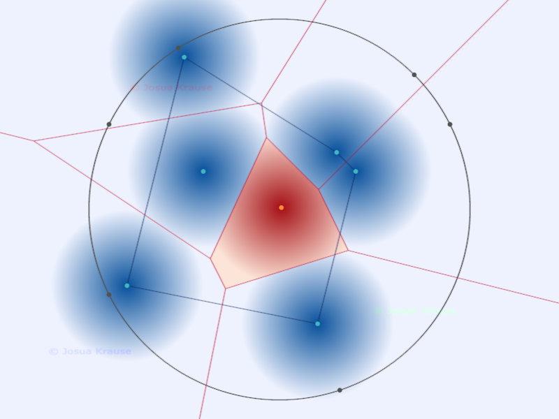

# Visualization for Various Similarity Functions

This visualization shows distances of various similarity functions in a 2D vector space.
You can add and remove points interactively. Boundaries of closest neighbor regions are shown in red.
Read more about it on [Medium](https://medium.com/@josua.krause/aff7667da6cc?source=friends_link&sk=1a7e02ec41f35b625fe5eb08da8623cb).

The live version can be found [here](https://josuakrause.github.io/searchspace/).

## Running Locally

The whole repo can be served as is. There is no build step.
For convenience the `make run-web` command exists to start a local file server.

## Converting Videos

After recording a video using the `Record` button it is saved in the `webm` format.
If a `gif` is needed, the `make convert INPUT=~/Downloads/video.webm` converts the
`webm` video and places the `gif` version into the same folder. `ffmpeg` is required.

## Contributing

If you encounter any bugs or problems, feel free to file an [issue](https://github.com/JosuaKrause/searchspace/issues).
